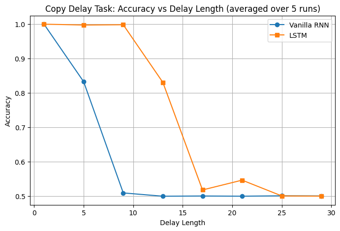

## Lab 3 - Task 1: Copy Delay Task

### 1. Descripción de la Tarea

La **Copy Delay Task** (tarea de copia con retardo) sirve para evaluar la capacidad de memoria a largo plazo de redes neuronales recurrentes.

La tarea consiste en dos fases:
1. **Fase de entrada**: La red recibe una secuencia de vectores binarios aleatorios (de tamaño `input_size`) durante los primeros `T` pasos de tiempo (donde T = `delay`).
2. **Fase de salida**: Durante los siguientes `T` pasos, la red recibe ceros (silencio) y debe reproducir como salida la secuencia original que recibió en la fase de entrada.

### 2. Cómputo del Error

El error se calcula utilizando **Binary Cross-Entropy with Logits Loss** (BCEWithLogitsLoss). Esta función de pérdida es apropiada porque:
- La salida esperada es binaria (0 o 1) para cada elemento del vector.
- Penaliza las predicciones incorrectas de forma proporcional a la confianza del modelo.
- Solo se evalúa la pérdida en la **fase de salida** (pasos T+1 a 2T), ignorando la fase de entrada.

La **accuracy** se calcula como el porcentaje de bits correctamente predichos, aplicando un umbral de 0.5 a la salida sigmoid.

### 3. Por qué esta Tarea Diferencia RNN de LSTM

Esta tarea expone directamente el **problema del vanishing gradient**. Durante el algoritmo de retropropagación a través del tiempo (BPTT), los gradientes deben viajar hacia atrás a través de todos los pasos de tiempo del delay. En cada paso temporal, el gradiente se multiplica por la matriz Jacobiana de los pesos recurrentes. Debido a la naturaleza multiplicativa de la regla de la cadena, si los valores propios de esta matriz son menores que 1, el gradiente se desvanece exponencialmente. Si son mayores que 1, explota. Cuanto mayor es el delay, más difícil resulta para una vanilla RNN "recordar" la información inicial, ya que el gradiente se reduce a valores casi nulos tras muchas multiplicaciones.

Las **LSTM** surgen como solución a este problema. A través de su arquitectura basada en cell state y gates, las LSTM crean una conexión más directa entre la entrada y la salida que permite que los gradientes fluyan sin degradarse significativamente. La cell state actúa como una "autopista" donde la información puede viajar sin ser multiplicada repetidamente por las mismas matrices de pesos, permitiendo mantener información relevante durante períodos más largos.

### 4. Experimentos Realizados

Con los parámetros por defecto, ambos modelos mostraban comportamiento similar. Para evidenciar la superioridad del LSTM, realizamos los siguientes ajustes:

- Aumentamos `hidden_size` de 32 a 128 para dar capacidad suficiente a ambos modelos.
- Aumentamos `batch_size` a 128 para mejor uso de GPU y gradientes más estables.
- Ajustamos `learning_rate` a 0.02 para convergencia más rápida.
- Implementamos early stopping con detección de convergencia (val_loss < 1e-4).

### 5. Resultados y Conclusiones

Los resultados muestran claramente la diferencia entre ambas arquitecturas:

- **Delay 1**: Ambos modelos alcanzan accuracy ~1.0 y convergen rápidamente.
- **Delay 5**: La RNN comienza a degradarse (~0.83) mientras LSTM mantiene accuracy alto (~1.0).
- **Delay 9**: La RNN cae hacia ~0.5 (predicción aleatoria) mientras LSTM mantiene accuracy alto (~1.0).

A partir de ahí, la accuracy de la LSTM empieza a degradarse, hasta llegar a 0.5 con la RNN en delay de 25.

Por tanto, podemos concluir que la LSTM es superior a la RNN en tareas que requieren dependencias temporales a largo plazo, validando empíricamente la efectividad de sus gates para combatir el vanishing gradient.

### 6. Parámetros Finales

| Parámetro | Valor |
|-----------|-------|
| `input_size` | 5 |
| `hidden_size` | 128 |
| `batch_size` | 128 |
| `learning_rate` | 0.02 |
| `max_epochs` | 50 |
| `patience` | 3 |
| `delays` | [1, 5, 9, 13, 17, 21, 25, 29] |
| `num_runs` | 5 |
| Convergence threshold | 1e-4 |
| Optimizer | Adam |
| Loss function | BCEWithLogitsLoss |

