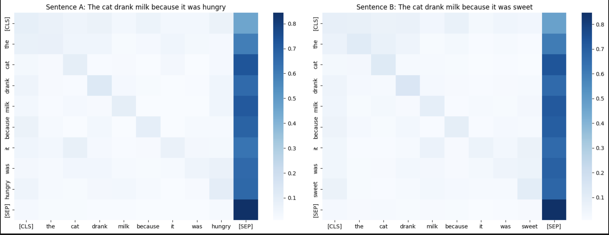
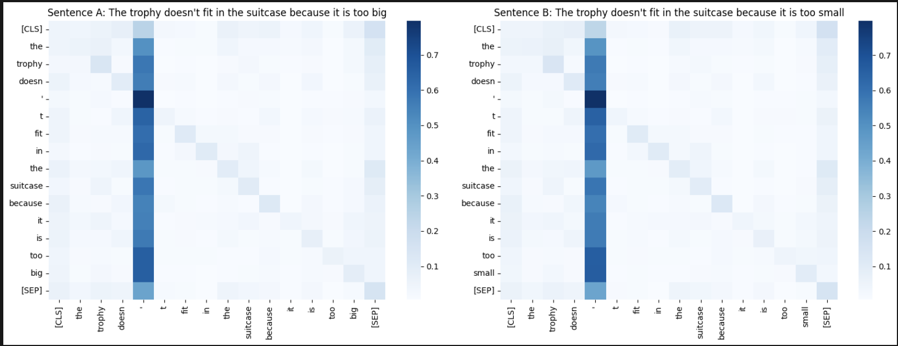

## Tarea: Analizar el mecanismo de self-attention de BERT

En esta tarea, hemos tomado 3 pares de frases distintas para estudiar los mecanismos de self-attention de BERT.

Para el primer par, "hungry vs sweet", vemos que "it" (pronombre) atiende más a la palabra "cat" (gato) en la primera frase, ya que es el gato el que está hambriento. Cuando cambiamos "hungry" por "sweet", la atención se focaliza "milk" (leche). Esto es esperable ya que la primera frase habla de un gato que bebe leche porque está hambriento (el gato), mientras que la segunda frase habla de un gato que bebe leche porque está dulce (la leche).

Para el segundo par, "big vs small", esto no ocurre. En ambos casos, la atención se focaliza en "trophy" (trofeo), aunque en la segunda frase "it" se refiera a la maleta, ya que dice que el trofeo no cabe en la maleta porque es demasiado pequeña. De hecho, en la segunda frase la atención sobre "suitcase", decae con respecto a la primera.

Esto se vuelve a repetir en el último ejemplo, "strong vs light", donde en la primera frase esperaríamos que la atención de "he" se centrase en "man", ya que el fuerte es el padre, que puede levantar al hijo, pero se centra en "son" incorrectamenre. En la segunda frase, sí que aplica la atención a "son", siendo esta mucho mayor que la de "man", ya que "light" se refiere al hijo.

Estos fallos se deben a que a pesar de ser un modelo muy avanzado, todavía no termina de capturar todas las sutilezas del lenguaje. En el caso de "big vs small", lo más probable es que elija "trophy" en ambos casos porque es el sujeto de la frase, y en el otro caso, "son" porque está más cerca de "he" que "man".

| # | Sentence | Pronoun→Cand1 | Pronoun→Cand2 | Attends to |
|---|----------|---------------|---------------|------------|
| 1A | "The cat drank milk because it was hungry" | it→cat: 0.0848 | it→milk: 0.0145 | **cat** |
| 1B | "The cat drank milk because it was sweet" | it→cat: 0.0137 | it→milk: 0.0640 | **milk** |
| 2A | "The trophy doesn't fit in the suitcase because it is too big" | it→trophy: 0.0469 | it→suitcase: 0.0337 | **trophy** |
| 2B | "The trophy doesn't fit in the suitcase because it is too small" | it→trophy: 0.0426 | it→suitcase: 0.0288 | **trophy** |
| 3A | "The man lifted his son because he was strong" | he→man: 0.0263 | he→son: 0.0619 | **son** |
| 3B | "The man lifted his son because he was light" | he→man: 0.0180 | he→son: 0.0791 | **son** |

Algo interesante que observamos es que, en muchos mapas de atención, aparece un token que concentra una fracción desproporcionada de la atención. Esto no implica necesariamente que ese token sea “el más importante” semánticamente, sino que puede actuar como un sumidero de atención. Como la normalización (softmax) obliga a que los pesos de atención sumen 1, cuando el modelo no encuentra una correspondencia clara o útil para cierto token, “aparca” parte de esa atención en tokens especiales como [SEP] o en signos de puntuación muy frecuentes.

