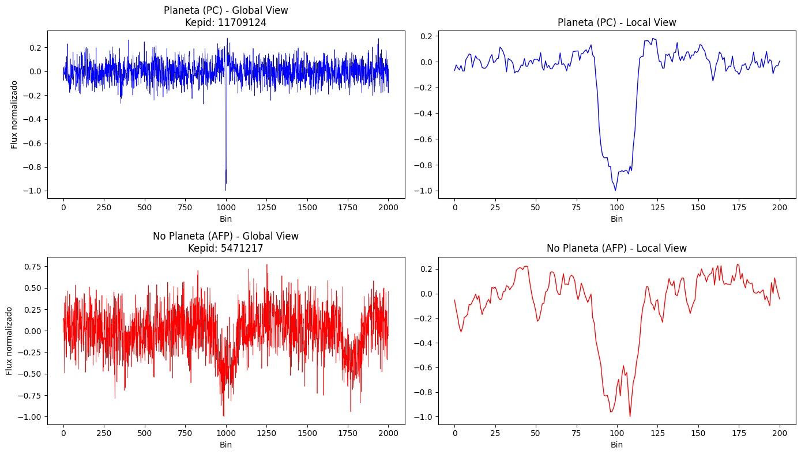
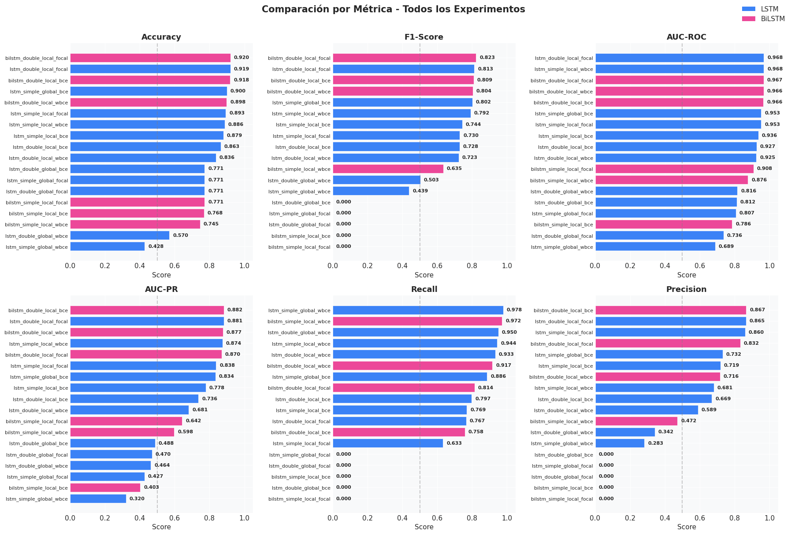

# Focal Loss para la detección de exoplanetas
## Estudio comparativo de arquitecturas de deep learning en curvas de luz Kepler desbalanceadas

**Autor:** Jorge Varea Durán  
**Asignatura:** Aprendizaje Profundo  
**Curso:** 2025-2026

# 1. Introducción

## 1.1 Contexto: Detección de exoplanetas por método de tránsitos

La búsqueda de planetas fuera de nuestro sistema solar —conocidos como **exoplanetas**— representa uno de los campos más activos de la astrofísica contemporánea. Desde el descubrimiento del primer exoplaneta confirmado orbitando una estrella de tipo solar en 1995, **51 Pegasi b** [[2]](#ref-2), se han confirmado **más de 6.000** cuerpos planetarios [[1]](#ref-1), revelando una diversidad extraordinaria de sistemas.

Entre las diversas técnicas de detección, el **método de tránsitos** se ha consolidado como el más prolífico. Este método se basa en un principio geométrico fundamental: cuando un planeta cruza nuestra línea de visión frente a su estrella anfitriona, bloquea una fracción de la luz estelar, produciendo una disminución periódica en el brillo observado. Esta señal, denominada **curva de luz**, presenta un patrón característico:

- **Ingreso (*Ingress*):** descenso gradual del flujo lumínico al iniciar el tránsito.
- **Fondo del tránsito:** período de brillo mínimo mientras el planeta oculta parte del disco estelar.
- **Egreso (*Egress*):** recuperación del brillo original.

La profundidad del tránsito ($\delta$) depende directamente de la razón de radios entre el planeta ($R_p$) y la estrella ($R_\star$):

$$
\delta \approx \left(\frac{R_p}{R_\star}\right)^2
$$

Para un gigante gaseoso como Júpiter frente a una estrella similar al Sol, esta disminución es cercana al 1%. Sin embargo, para planetas terrestres, la atenuación puede ser del orden de **0.01%**. Esta señal tan tenue, a menudo comparable en magnitud al ruido instrumental y a la variabilidad estelar intrínseca, convierte su identificación en un desafío de procesamiento de señales crítico, propenso a una alta tasa de falsos positivos.

## 1.2 Misión Kepler y catálogos DR24/DR25

La **Misión Kepler** de la NASA fue lanzada en 2009 con el objetivo de monitorizar de forma continua aproximadamente **200.000 estrellas** en una región del cielo entre las constelaciones de Cygnus y Lyra [[6]](#ref-6). Durante los cuatro años de su misión primaria (2009-2013), el telescopio registró el brillo de estas estrellas con una precisión fotométrica sin precedentes, buscando las pequeñas variaciones características de los tránsitos planetarios [[3]](#ref-3).

El legado científico de Kepler es extraordinario:
- Más de **2.600 exoplanetas confirmados** hasta la fecha [[4]](#ref-4).
- Miles de candidatos adicionales pendientes de validación.
- Datos públicos que han permitido innumerables descubrimientos posteriores.

### Los Data Releases: DR24 vs DR25

El procesado de datos de Kepler ha evolucionado a través de varias versiones (*Data Releases*). Es fundamental distinguir entre las dos más relevantes para el *Machine Learning*:

1.  **Data Release 24 (DR24):** Generado con el pipeline SOC 9.2. Fue el primer catálogo en utilizar un "Autovetter" totalmente automatizado para clasificar señales (basado en reglas lógicas). Este dataset (~15.700 TCEs clasificados) se convirtió en el estándar para entrenar redes neuronales gracias al trabajo pionero de Shallue & Vanderburg (2018) y sigue siendo utilizado por trabajos recientes como Thomas et al. (2025) para garantizar la comparabilidad de resultados.

2.  **Data Release 25 (DR25):** Representa el catálogo final y definitivo de la misión. Utilizando el pipeline SOC 9.3 y un Robovetter mejorado, ofrece la clasificación más fiable de "Objetos de Interés" (KOIs) [[5]](#ref-5).

Las etiquetas utilizadas en estos catálogos para clasificar las señales (*Threshold Crossing Events*) se dividen en tres categorías principales [[6]](#ref-6):

| Etiqueta (Label) | Categoría | Descripción |
| :--- | :--- | :--- |
| **PC / CONFIRMED** | Planetas / Candidatos | Señales compatibles con un tránsito planetario. En datasets de ML, la etiqueta "Planet Candidate" (PC) agrupa tanto a confirmados como a candidatos fuertes. |
| **AFP** | Falso Positivo Astrofísico | Señales causadas por fenómenos reales pero no planetarios, como binarias eclipsantes (EBs) o contaminación de fondo. |
| **NTP** | Fenómeno No Tránsito | Falsos positivos instrumentales, ruido o variabilidad estelar que imitan la forma de un tránsito. |

## 1.3 Formulación como problema de clasificación binaria

Para el entrenamiento de modelos de *Deep Learning*, la taxonomía original de Kepler se reestructura habitualmente como un problema de **clasificación binaria**. Siguiendo la metodología establecida por Shallue & Vanderburg [[9]](#ref-9) y mantenida en trabajos recientes como Thomas et al. [[7]](#ref-7), las etiquetas se agrupan para consolidar una definición robusta de "posible planeta" frente a "ruido o falso positivo".

Esta simplificación binaria se define de la siguiente manera:

*   **Clase Positiva (1):** Agrupa las etiquetas **Planet Candidate (PC)** y **Confirmed Planet**. Se asume que cualquier señal que haya superado los vetos astrofísicos iniciales (incluso si permanece como candidato) contiene patrones morfológicos de tránsito legítimos que el modelo debe aprender a identificar.
*   **Clase Negativa (0):** Agrupa los **Falsos Positivos Astrofísicos (AFP)** (como binarias eclipsantes) y los **Fenómenos No Transitantes (NTP)** (ruido instrumental o variabilidad estelar).

La distribución resultante en el dataset de referencia (~15.700 muestras) presenta aproximadamente **3.600 ejemplos positivos** frente a **12.100 negativos** [[7]](#ref-7). Esta proporción de **1:3.37** configura un escenario de desbalance moderado pero significativo, donde la clase mayoritaria (no planetas) domina el proceso de optimización, lo que justifica la necesidad de técnicas especializadas como *Focal Loss*.

## 1.4 Problema del desbalance de clases

El desbalance de clases introduce varios problemas críticos en el entrenamiento de modelos de clasificación:

1.  **Sesgo hacia la clase mayoritaria:** Los algoritmos de optimización tienden a minimizar el error global. En un dataset desbalanceado, un modelo trivial que prediga siempre la clase mayoritaria obtiene una *accuracy* aparentemente alta (~77% según nuestro ratio), pero es inútil para detectar planetas.
2.  **Gradientes dominados por ejemplos fáciles:** La mayoría de ejemplos de la clase mayoritaria son "fáciles" de clasificar (curvas planas o con ruido evidente), lo que genera gradientes pequeños pero numerosos que enmascaran la señal de aprendizaje de los ejemplos difíciles.
3.  **Subrepresentación de casos límite:** Los tránsitos más débiles (bajo SNR), que son los más interesantes científicamente ya que pueden ser planetas rocosos como la Tierra, son inherentemente más difíciles de distinguir y suelen ser ignorados durante el entrenamiento estándar.

### 1.4.1 Enfoques tradicionales para el desbalance

| Técnica | Descripción | Limitaciones |
| :--- | :--- | :--- |
| **Submuestreo** | Reducir ejemplos de clase mayoritaria | Pérdida de información valiosa |
| **Sobremuestreo** | Replicar ejemplos de clase minoritaria | Riesgo de *overfitting* |
| **SMOTE** | Generar ejemplos sintéticos por interpolación | Puede introducir ruido en fronteras de decisión complejas |
| **Weighted BCE** | Ponderar la pérdida por frecuencia inversa de clase | No distingue entre ejemplos fáciles y difíciles |

### 1.4.2 La limitación de Weighted Binary Cross-Entropy

La **Weighted Binary Cross-Entropy (WBCE)** es el enfoque más común para desbalance en clasificación binaria:

$$
\mathcal{L}_{WBCE} = -\frac{1}{N}\sum_{i=1}^{N} \left[ w_1 \cdot y_i \log(\hat{y}_i) + w_0 \cdot (1-y_i) \log(1-\hat{y}_i) \right]
$$

donde $w_1$ y $w_0$ son pesos inversamente proporcionales a la frecuencia de cada clase.

Sin embargo, WBCE tiene una **limitación fundamental**: trata todos los ejemplos de una clase por igual. Un falso positivo obvio (como una binaria eclipsante muy profunda) recibe el mismo peso de importancia que un caso ambiguo cercano a la frontera de decisión.

### 1.4.3 Focal Loss: concentrando el aprendizaje en ejemplos difíciles

**Focal Loss**, propuesta originalmente por Lin et al. [[8]](#ref-8) para detección de objetos en imágenes, introduce un factor modulador que reduce dinámicamente la contribución de los ejemplos bien clasificados ("fáciles"):

$$
\mathcal{L}_{FL} = -\frac{1}{N}\sum_{i=1}^{N} \alpha_t (1-p_t)^\gamma \log(p_t)
$$

donde:
- $p_t = \hat{y}_i$ si $y_i = 1$, y $p_t = 1 - \hat{y}_i$ si $y_i = 0$.
- $\alpha_t$ es un factor de ponderación por clase (similar a WBCE) para balancear la importancia global.
- $\gamma \geq 0$ es el **parámetro de enfoque** (*focusing parameter*).

El término $(1-p_t)^\gamma$ es la clave del funcionamiento:
- Cuando un ejemplo está **bien clasificado** ($p_t \rightarrow 1$), el factor $(1-p_t)^\gamma \rightarrow 0$, anulando su contribución a la pérdida.
- Cuando un ejemplo está **mal clasificado** o es ambiguo ($p_t \rightarrow 0$), el factor se acerca a 1, manteniendo su contribución intacta.

Con un valor típico de $\gamma = 2$, un ejemplo clasificado con alta confianza ($p_t = 0.9$) tiene su pérdida reducida **100 veces** respecto a la entropía cruzada estándar, obligando al modelo a concentrarse casi exclusivamente en corregir los errores difíciles.

Esta propiedad hace de *Focal Loss* una candidata ideal para la detección de exoplanetas: permite al modelo ignorar los miles de "no-tránsitos" evidentes y centrar el aprendizaje en los tránsitos de bajo SNR y los falsos positivos sutiles.

### 1.4.4 Muestreo estratificado como técnica de balanceo dinámico

Una estrategia complementaria (y en algunos casos alternativa) al uso de funciones de pérdida ponderadas consiste en modificar la forma en que se seleccionan las muestras durante el entrenamiento mediante **muestreo estratificado** (stratified sampling).

En lugar de alterar los valores de la pérdida, esta técnica actúa directamente sobre la composición de los batches: obliga al modelo a ver una proporción más equilibrada de ejemplos de ambas clases en cada actualización de gradientes.

En la práctica, el muestreo estratificado **no sustituye completamente** a las funciones de pérdida ponderadas o focal, sino que las **complementa** de manera muy efectiva. Trabajos recientes como Thomas et al., 2025, combinan ambas estrategias (muestreo balanceado + WBCE) para obtener mejores resultados.

En nuestros experimentos se evaluarán sistemáticamente las configuraciones con y sin muestreo estratificado, permitiendo cuantificar su contribución relativa frente a las diferentes funciones de pérdida consideradas.

## 1.5 Trabajos Relacionados

La aplicación de *Deep Learning* a la detección de exoplanetas en curvas de luz de Kepler ha evolucionado rápidamente desde las primeras arquitecturas convolucionales simples hasta modelos híbridos complejos. A continuación, se resumen los resultados de las arquitecturas más relevantes que han servido de base para este estudio.

| Trabajo | Dataset | Arquitectura | Accuracy | Precision | Recall | F1-Score | AUC (ROC) |
| :--- | :--- | :--- | :--- | :--- | :--- | :--- | :--- |
| **Shallue & Vanderburg (2018)** [[9]](#ref-9) | DR24 | CNN (Global + Local) | 0.960 | - | - | 0.879 | 0.988 |
| **Marques (2018)** [[10]](#ref-10) | DR24 | CNN / LSTM | 0.935 / 0.934 | 0.938 / 0.936 | 0.935 / 0.934 | 0.936 / 0.935 | 0.965 |
| **Scannell (2021)** [[11]](#ref-11) | DR24 | LSTM (Best Model) | 0.920 | 0.790 | 0.870 | 0.828 | 0.970 |
| **Scannell (2021)** [[11]](#ref-11) | DR24 | CCN-LSTM (Hybrid) | 0.950 | 0.900 | 0.910 | 0.900 | 0.980 |
| **Salinas et al. (2023)** [[12]](#ref-12) | TESS | Transformer | - | 0.880 | 0.880 | 0.880 | - |
| **Thomas et al. (2025)** [[7]](#ref-7) | DR24 y DR25* | CNN-BiLSTM-Attn | 0.957 | 0.893 | 0.928 | 0.910 | 0.984 |

Los resultados de Marques, a pesar de ser los mejores, solo aparecen publicados en Github, como trabajo fin de máster, no han sido peer-reviewed, y no se mencionan en trabajos posteriores. Lo más probable es que simplemente sean los resultados del mejor experimento y no promedios sobre múltiples. En el estudio de Thomas et al., se menciona estudios con transformers donde se obtiene un F1-score de 0.99, pero no se indica el estudio concreto, y el único que se parece a lo que describe es Salinas et al. (2023) [[12]](#ref-12), pero dista mucho del resultado mencionado.

*Thomas et al. entrena sobre DR24 y sus métricas son sobre ese dataset, aunque luego valida sus resultados también sobre DR25

## 1.6 Objetivos del estudio

Este estudio tiene como objetivo principal evaluar si el uso de **Focal Loss** mejora significativamente la capacidad de detección de exoplanetas en el contexto del fuerte desbalance de clases del catálogo Kepler DR24, comparándolo con la función de pérdida estándar (*Weighted Binary Cross-Entropy*). Utilizaremos el catálogo DR24 para poder comparar nuestros resultados con estudios anteriores.

Para ello, se plantean los siguientes objetivos específicos:

1.  **Comparativa de Funciones de Pérdida:** Evaluar sistemáticamente el rendimiento de *Focal Loss* frente a *Weighted BCE* y *BCE*, usando y sin usar, muestreo estratificado.

2.  **Análisis por Arquitectura:** Estudiar la consistencia de estas mejoras a través de cuatro arquitecturas de *Deep Learning* de complejidad creciente:
    -   LSTM unidireccional
    -   BiLSTM (Bidirectional LSTM)
    -   CNN (Convolutional Neural Network)
    -   CNN-BiLSTM-Attention (Arquitectura híbrida)

### Métricas de evaluación

| Métrica | Descripción | Relevancia |
| :--- | :--- | :--- |
| **Accuracy** | $\frac{TP + TN}{Total}$ | Porcentaje total de aciertos. Puede ser engañoso en datasets desbalanceados (un modelo que diga siempre "No Planeta" tendría alta accuracy). |
| **Precision** | $\frac{TP}{TP + FP}$ | ¿Qué proporción de planetas predichos son realmente planetas? (Evitar falsas alarmas). |
| **Recall** | $\frac{TP}{TP + FN}$ | ¿Qué proporción de los planetas existentes somos capaces de encontrar? (Sensibilidad). |
| **F1-Score** | Media armónica | Balance único entre Precision y Recall. Es la métrica clave cuando se busca un compromiso entre no perder planetas y no validar basura. |
| **AUC-PR** | Área bajo curva PR | Evalúa la calidad del detector sobre la clase minoritaria (planetas) a través de todos los umbrales de decisión. |
| **AUC-ROC** | Área bajo curva ROC | Capacidad global de separación entre clases. Métrica estándar para comparación histórica con otros papers. |

## 2. Preprocesamiento de datos y generación de vistas

En este trabajo, partimos del pipeline de preprocesamiento establecido por Shallue & Vanderburg [[9]](#ref-9), que se ha convertido en el estándar *de facto* para la clasificación de exoplanetas con *Deep Learning*.

En lugar de procesar las curvas de luz crudas desde cero, utilizamos el dataset limpio proporcionado por el equipo de Google Research, que ofrece de forma pública los TFRecord con los que han entrenado. Ya vienen divididos en training, validación y test, con una división 80-10-10, que será la misma que usaremos. Este conjunto de datos aplica una secuencia rigurosa de transformaciones sobre las curvas de luz calibradas de la misión Kepler (catálogo DR24) para maximizar la relación señal-ruido de los tránsitos. La forma en la que se ha realizado este procesamiento es la siguiente.

### 2.1 Secuencia de procesamiento

El pipeline de generación de datos, cuyas salidas utilizamos como entrada para nuestros modelos, consta de los siguientes pasos críticos:

1.  **Eliminación de Outliers y Tendencias (Detrending):**
    Se utiliza un ajuste de *spline* iterativo para modelar y sustraer la variabilidad estelar de baja frecuencia (manchas solares, rotación estelar) y el ruido instrumental de larga duración. Esto aplana la curva de luz, dejando idealmente solo los eventos de tránsito y el ruido blanco gaussiano. Los puntos que se desvían más de $3\sigma$ (como rayos cósmicos) son eliminados.

2.  **Doblado de la curva (Phase Folding):**
    Dado que los tránsitos son periódicos, la serie temporal completa de 4 años se "dobla" sobre sí misma utilizando el periodo, la época y la duración del evento detectado (TCE).
    
    Esta operación alinea todos los tránsitos observados, lo que aumenta significativamente la densidad de puntos dentro del tránsito y reduce el ruido aleatorio al promediar múltiples eventos.

3.  **Binning y Generación de Vistas (Global & Local Views):**
    Una vez doblada la curva, la densidad de puntos varía según el periodo y la cantidad de observaciones disponibles. Para homogeneizar la entrada de la red neuronal y reducir el ruido aleatorio, se aplica un **binning uniforme**. Se divide el eje de fase en un número fijo de intervalos (*bins*) y se calcula el valor mediano del flujo dentro de cada uno. Este proceso genera dos representaciones vectoriales de longitud fija para cada estrella:

    *   **Vista Global (Global View):**
        Un vector de **2001 puntos** que cubre toda la fase orbital y permite detectar características fuera del tránsito principal, como eclipses secundarios (indicativos de binarias eclipsantes) o variabilidad estelar residual.

    *   **Vista Local (Local View):**
        Un vector de **201 puntos** que hace un "zoom" exclusivo sobre el evento de tránsito, cubriendo un ancho de 4 veces la duración del tránsito. Proporciona la máxima resolución posible y es crucial para distinguir la forma de "U" (característica de planetas) de la forma de "V" (típica de binarias eclipsantes).

4.  **Normalización:**
    Finalmente, ambas vistas se normalizan para tener mediana 0 y desviación estándar 1. Esto es fundamental para la convergencia estable de los optimizadores de gradiente descendente en las redes neuronales.

El resultado final que ingesta nuestro modelo es un par de vectores `(global_view, local_view)` para cada Objeto de Interés (KOI/TCE), junto con su etiqueta binaria correspondiente.

### 2.2 Ejemplo de vista Local y Global

En la imagen de arriba, podemos ver un ejemplo de Planeta Confirmado, donde la luz de la estrella disminuye gradualmente conforme el planeta entra dentro del radio solar, se estabiliza en un mínimo mientras el planeta transita (teóricamente, el fondo debería ser plano ya que no varía la luz de la estrella en esta fase), y luego se recupera gradualmente $\rightarrow$  Forma de "U".

Abajo tenemos un ejemplo de Falso Positivo Astrofísico, una Binaria Eclipsante, donde vemos que la luz de la estrella disminuye, pero en el mínimo no existe ese tránsito, ya que en vez de estabilizarse la curva de luz, "rebota" $\rightarrow$ Forma de "V".



# 3. Metodología

Para evaluar de forma sistemática el impacto de la función de pérdida y la complejidad de la arquitectura en la detección de exoplanetas, se establecen unas condiciones comunes a todos los experimentos. Estas condiciones se basan en la metodología más reciente (Thomas et al., 2025).

## 3.1 Inicialización de pesos

Para asegurar una propagación estable de los gradientes y una convergencia más rápida y robusta del modelo, se adopta el método de inicialización Kaiming/He de forma uniforme en todas las capas del modelo. Este esquema, propuesto por He et al. (2015) [[13]]((#ref-13)), ajusta la varianza de los pesos en función de la activación ReLU, minimizando el riesgo de vanishing o exploding gradients en redes profundas y con componentes recurrentes. En general, en trabajos anteriores no se le da mucha importancia y simplemente se usan los valores de la librería por defecto, aunque en este caso, nosotros hemos decidido usar esta inicialización concreta, que suele funcionar mejor.

## 3.2 Optimizador y regularización

Para el entrenamiento del modelo se emplea el optimizador **AdamW** con los hiperparámetros $\beta_1=0.9$, $\beta_2=0.999$ y $\epsilon=10^{-4}$, junto con un **weight decay** de $2 \times 10^{-4}$. A diferencia del optimizador Adam utilizado en Thomas et al. (2025), AdamW implementa la regularización L2 de manera correcta al separar el término de decaimiento de pesos del update adaptativo de los momentos, evitando así la interacción no deseada entre el weight decay y la adaptación de learning rate que ocurre en Adam clásico.

## 3.3 Learning rate adaptativo

Para optimizar la convergencia y evitar oscilaciones o estancamiento durante el entrenamiento, se implementa una estrategia de **learning rate adaptativo** mediante el scheduler **ReduceLROnPlateau**. El learning rate inicial se establece en $\alpha=10^{-4}$ (para LSTM, BiLSTM y CNN-BiLSTM-Attention). El scheduler monitoriza la pérdida de validación y reduce el learning rate en un factor de 0.5 si no se observa mejora durante 5 épocas consecutivas. Se aplica un **cooldown** de 2 épocas después de cada reducción, durante las cuales el scheduler no realiza más ajustes, permitiendo al modelo estabilizarse tras el cambio. El learning rate mínimo se fija en $\alpha=10^{-6}$, evitando valores tan bajos que hagan prácticamente nula la actualización de los pesos.

## 3.4 Early stopping

Para prevenir el sobreajuste y optimizar el uso de recursos computacionales, se implementa una estrategia de **early stopping** con un máximo de 100 épocas de entrenamiento. El criterio de detención temprana monitoriza la función de pérdida en el conjunto de validación, deteniendo el entrenamiento si no se observa mejora durante **10 épocas consecutivas** (patience = 10). Esta configuración permite al modelo continuar refinándose mientras exista ganancia significativa en rendimiento, pero interrumpe el proceso antes de que comience a memorizar ruido específico del conjunto de entrenamiento.

## 3.5 Gradient Clipping

Para prevenir el problema de **gradientes explosivos** (exploding gradients), se aplica **gradient clipping** con un valor máximo de norma igual a 1.0. Esta técnica consiste en recortar la norma L2 de todos los gradientes acumulados antes de realizar la actualización de los parámetros, asegurando que ningún gradiente supere el umbral establecido.

## 3.5 Focal Loss

Para el Focal Loss, usaremos los valores de $\gamma=2.0$ y $\alpha=0.25$ recomendados por Lin et al. [[8]](#ref-8).

## 3.6 Función de pérdida

Todas las configuraciones emplean la salida cruda del modelo en forma de **logits** (valores lineales sin activación sigmoide) como salida final de la última capa densa. Esta elección permite utilizar de manera numéricamente estable las tres funciones de pérdida consideradas —**Binary Cross-Entropy with Logits Loss**, **Weighted Binary Cross-Entropy with Logits** y **Focal Loss** (implementada sobre `binary_cross_entropy_with_logits`)—, combinando en una única operación la activación sigmoide y la entropía cruzada binaria. De este modo se evitan inestabilidades asociadas a probabilidades extremas cercanas a 0 o 1.

### 3.7 Evaluación estadística

Para garantizar la robustez de los resultados y cuantificar adecuadamente la variabilidad inherente al entrenamiento de estos modelos, se ejecutan **5 runs independientes** de cada configuración experimental, utilizando una semilla aleatoria diferente en cada una. Para cada métrica de interés se calcula la **media** y la **desviación estándar** sobre las 5 runs, reportando los resultados en formato mean ± std. Esta cantidad de repeticiones (5) representa un equilibrio entre rigor estadístico y viabilidad computacional.

# 4. Resultados

## 4.1 Configuración Experimental: LSTM y BiLSTM

De alguna manera, todos los experimentos usan tanto la vista global como la local en sus arquitecturas. Nosotros seguiremos la misma lógica. Basándonos en los experimentos de (Scannell, 2021), configuramos la arquitectura de la siguiente manera:

- Vista Global: 2 capas LSTM apiladas (128 → 64 hidden_size)
- Vista Local: 1 capa LSTM (64 hidden_size)
- Concatenación de hidden states finales
- Capa densa(64) + Dropout(0.2) → Capa densa(32) → Output(1)

En esta configuración, usaremos tanto LSTMs como BiLSTMs, y estudiaremos las tres funciones de pérdida elegidas, BCE, WBCE y Focal Loss, con o sin muestreo estratificado.

Usaremos un batch size de 64.

## 4.2 LSTM y BiLSTM

# TODO

## 4.3 Configuración experimental CNN

Para estudiar el rendimiento de nuestras funciones de pérdida sobre redes convolucionales, tomamos la arquitectura de Scannell, 2021, que es una versión reducida de la arquitectura original de Shallue & Vanderburg, 2018, que sufre menos de overfitting. La configuración es la siguiente:

Vista Local:
    - 2x Conv1D(16 filtros, kernel=5) + MaxPool(5)
    - 2x Conv1D(32 filtros, kernel=5) + MaxPool(5)
    
Vista Global:
    - 2x Conv1D(16 filtros, kernel=5) + MaxPool(5)
    - 2x Conv1D(32 filtros, kernel=5) + MaxPool(5)
    - 2x Conv1D(64 filtros, kernel=5) + MaxPool(5)  [bloque adicional]
    
Conectamos concatenando entradas:
    - 3x Capa densa(64) + Dropout(0.2)
    - Capa densa(1)

En este caso, usaremos un batch size de 128 y un learning rate inicial de 0.006, igual que Scannell, 2021.

## 4.4 CNN

# TODO

## 4.5 Configuración experimental CNN-BiLSTM-Attention

Replicamos la arquitectura de Thomas et al., 2025. Aunque solo aparezca una rama, en realidad son dos, una para la vista global y otra para la local, que se concatenan tras las capas de atención, antes de la red FC.

```
Input Light Curve Data
         ↓
    [batch_size, length]
         ↓
┌─────────────────────────────────────────────────────────────────────────────┐
│                           CNN FEATURE EXTRACTION                            │
├─────────────────────────────────────────────────────────────────────────────┤
│  Input: [batch_size, length] → [batch_size, length, 1] (expand dims)        │
│                                                                             │
│  Block 1: filters = 16                                                      │
│  ├── Conv1D(kernel=5, filters=16, activation=ReLU, padding=same)            │
│  ├── Conv1D(kernel=5, filters=16, activation=ReLU, padding=same)            │
│  ├── Dropout(0.2) (if training)                                             │
│  └── MaxPool1D(pool_size=5, strides=2)                                      │
│                                                                             │
│  Block 2: filters = 32                                                      │
│  ├── Conv1D(kernel=5, filters=32, activation=ReLU, padding=same)            │
│  ├── Conv1D(kernel=5, filters=32, activation=ReLU, padding=same)            │
│  ├── Dropout(0.2) (if training)                                             │
│  └── MaxPool1D(pool_size=5, strides=2)                                      │
│                                                                             │
│  Block 3: filters = 64                                                      │
│  ├── Conv1D(kernel=5, filters=64, activation=ReLU, padding=same)            │
│  ├── Conv1D(kernel=5, filters=64, activation=ReLU, padding=same)            │
│  ├── Dropout(0.2) (if training)                                             │
│  └── MaxPool1D(pool_size=5, strides=2)                                      │
│                                                                             │
│  Block 4: filters = 128                                                     │
│  ├── Conv1D(kernel=5, filters=128, activation=ReLU, padding=same)           │
│  ├── Conv1D(kernel=5, filters=128, activation=ReLU, padding=same)           │
│  ├── Dropout(0.2) (if training)                                             │
│  └── MaxPool1D(pool_size=5, strides=2)                                      │
│                                                                             │
│  Block 5: filters = 256                                                     │
│  ├── Conv1D(kernel=5, filters=256, activation=ReLU, padding=same)           │
│  ├── Conv1D(kernel=5, filters=256, activation=ReLU, padding=same)           │
│  ├── Dropout(0.2) (if training)                                             │
│  └── MaxPool1D(pool_size=5, strides=2)                                      │
│                                                                             │
│  Output: [batch_size, reduced_sequence_length, 256]                         │
└─────────────────────────────────────────────────────────────────────────────┘
         ↓
┌─────────────────────────────────────────────────────────────────────────────┐
│                        BIDIRECTIONAL LSTM LAYERS                            │
├─────────────────────────────────────────────────────────────────────────────┤
│  Input: [batch_size, sequence_length, 256]                                  │
│                                                                             │
│  BiLSTM Layer 1: 128 units                                                  │
│  ├── Forward LSTM: 128 units                                                │
│  ├── Backward LSTM: 128 units                                               │
│  ├── Dropout: 0.3 (if training)                                             │
│  ├── Recurrent Dropout: 0.2                                                 │
│  └── Concatenate → [batch_size, sequence_length, 256]                       │
│                                                                             │
│  BiLSTM Layer 2: 128 units                                                  │
│  ├── Forward LSTM: 128 units                                                │
│  ├── Backward LSTM: 128 units                                               │
│  ├── Dropout: 0.3 (if training)                                             │
│  ├── Recurrent Dropout: 0.2                                                 │
│  └── Concatenate → [batch_size, sequence_length, 256]                       │
│                                                                             │
│  Output: [batch_size, sequence_length, 256] (returns sequences)             │
└─────────────────────────────────────────────────────────────────────────────┘
         ↓
┌─────────────────────────────────────────────────────────────────────────────┐
│                          ATTENTION MECHANISM                                │
├─────────────────────────────────────────────────────────────────────────────┤
│  Input: [batch_size, sequence_length, 256]                                  │
│                                                                             │
│  Attention Score Computation:                                               │
│  ├── Dense(1, activation=tanh) → [batch_size, sequence_length, 1]           │
│  ├── Softmax(axis=1) → attention_weights [batch_size, sequence_length, 1]   │
│  └── Weighted Sum → context_vector [batch_size, 256]                        │
│                                                                             │
│  Formula: context = Σ(attention_weights[i] * hidden_states[i])              │
│                                                                             │
│  Output: [batch_size, 256] (context vector)                                 │
└─────────────────────────────────────────────────────────────────────────────┘
         ↓
┌─────────────────────────────────────────────────────────────────────────────┐
│                    FEATURE CONCATENATION & PROCESSING                       │
├─────────────────────────────────────────────────────────────────────────────┤
│  Multiple Time Series Features (if any):                                    │
│  ├── global_view: [batch_size, 256]                                         │
│  ├── local_view: [batch_size, 256] (if configured)                          │
│  └── Concatenate → [batch_size, total_features]                             │
│                                                                             │
│  Auxiliary Features (if any):                                               │
│  ├── period, duration, etc.: [batch_size, aux_features]                     │
│  └── Concatenate with time series features                                  │
│                                                                             │
│  Output: pre_logits_concat [batch_size, total_feature_size]                 │
└─────────────────────────────────────────────────────────────────────────────┘
         ↓
┌─────────────────────────────────────────────────────────────────────────────┐
│                      FULLY CONNECTED LAYERS                                 │
├─────────────────────────────────────────────────────────────────────────────┤
│  Input: [batch_size, total_feature_size]                                    │
│                                                                             │
│  Pre-Logits Hidden Layers (4 layers):                                       │
│  ├── Dense(1024, activation=ReLU)                                           │
│  ├── Dropout(0.2) (if training)                                             │
│  ├── Dense(1024, activation=ReLU)                                           │
│  ├── Dropout(0.2) (if training)                                             │
│  ├── Dense(1024, activation=ReLU)                                           │
│  ├── Dropout(0.2) (if training)                                             │
│  ├── Dense(1024, activation=ReLU)                                           │
│  └── Dropout(0.2) (if training)                                             │
│                                                                             │
│  Output: [batch_size, 1024]                                                 │
└─────────────────────────────────────────────────────────────────────────────┘
         ↓
┌─────────────────────────────────────────────────────────────────────────────┐
│                         OUTPUT LAYER                                        │
├─────────────────────────────────────────────────────────────────────────────┤
│  Logits Layer:                                                              │
│  └── Dense(1) → [batch_size, 1] (raw logits)                                │
│                                                                             │
│  Predictions:                                                               │
│  └── Sigmoid(logits) → [batch_size, 1] (probabilities 0-1)                  │
│                                                                             │
│  Loss (during training):                                                    │
│  └── Binary Cross-Entropy with Label Smoothing                              │
└─────────────────────────────────────────────────────────────────────────────┘
         ↓
    Final Prediction
   (Planet/Not Planet)
```

La lógica detrás de esta arquitectura es la siguiente. Las capas convolucionales extraen las características morfológicas locales de las curvas, como la forma y la profundidad de los tránsitos. Tras esto, la BiLSTM modela las dependencias secuenciales, permitiendo a la red reconocer patrones periódicos e información contextual alrededor de los tránsitos. Por último, la capa de atención señala las áreas más informativas de la curva de luz, incluyendo tránsito, ingreso y egreso. En este escenario, las capas de BiLSTM dominan, concentrando el 96.54% de los parámetros. Thomas et al. [[7]](#ref-7)

Para el batch size, usaremos 64, igual que Thomas et al. (2025).

## 4.6 CNN-BiLSTM-Attention

# TODO

## 4.7 Comparativa de arquitecturas

# TODO

# Trabajos futuros
- Probar LSTM de Marques con Focal
- Probar diferentes valores de Focal Alpha y Focal Gamma
- Comparar los Max-F1-Scores
- Probar comparativa loss sobre arquitectura híbrida CNN-LSTM

# Referencias

<a id="ref-1"></a>
**[1]** NASA. (17 de septiembre de 2025). *NASA's Tally of Planets Outside Our Solar System Reaches 6,000*. NASA Exoplanet Exploration. [Enlace](https://www.nasa.gov/universe/exoplanets/nasas-tally-of-planets-outside-our-solar-system-reaches-6000/)

<a id="ref-2"></a>
**[2]** Mayor, M., & Queloz, D. (1995). A Jupiter-mass companion to a solar-type star. *Nature*, 378(6555), 355–359. [DOI:10.1038/378355a0](https://doi.org/10.1038/378355a0)

<a id="ref-3"></a>
**[3]** Borucki, W. J., et al. (2010). Kepler Planet-Detection Mission: Introduction and First Results. *Science*, 327(5968), 977-980. [DOI: 10.1126/science.1185402](https://doi.org/10.1126/science.1185402)

<a id="ref-4"></a>
**[4]** NASA Jet Propulsion Laboratory. (2018). *Kepler Exoplanet Mission*. Recuperado el 8 de enero de 2026. [Enlace](https://www.jpl.nasa.gov/missions/kepler/)

<a id="ref-5"></a>
**[5]** Twicken, J. D., et al. (2016). Kepler Data Validation II—Transit Signal Validation and Classification for Data Release 25. *The Astronomical Journal*, 152(6), 158. [DOI: 10.3847/0004-6256/152/6/158](https://doi.org/10.3847/0004-6256/152/6/158)

<a id="ref-6"></a>
**[6]** Thompson, S. E., et al. (2018). Planetary Candidates Observed by Kepler. VIII. A Fully Automated Catalog with Measured Completeness and Reliability Based on Data Release 25. *The Astrophysical Journal Supplement Series*, 235(2), 38. [DOI: 10.3847/1538-4365/aab4f9](https://doi.org/10.3847/1538-4365/aab4f9)

<a id="ref-7"></a>
**[7]** Thomas, Bibin., Bhat, M. V., Mohammed, S. A., Mohammed, A. W., Dessalegn, A. A., & Mittal, M. (2025). Identifying exoplanets with deep learning: A CNN and RNN classifier for Kepler DR25 and candidate vetting. arXiv preprint arXiv:2509.04793. [DOI: 10.48550/arXiv.2509.04793](https://doi.org/10.48550/arXiv.2509.04793)

<a id="ref-8"></a>
**[8]** Lin, T. Y., Goyal, P., Girshick, R., He, K., & Dollár, P. (2017). Focal Loss for Dense Object Detection. *Proceedings of the IEEE International Conference on Computer Vision (ICCV)*, 2980-2988. [Enlace](https://arxiv.org/abs/1708.02002)

<a id="ref-9"></a>
**[9]** Shallue, C. J., & Vanderburg, A. (2018). Identifying Exoplanets with Deep Learning: A Five-planet Resonant Chain around Kepler-80 and an Eighth Planet around Kepler-90. *The Astronomical Journal*, 155(2), 94. [DOI: 10.3847/1538-3881/aa9e09](https://doi.org/10.3847/1538-3881/aa9e09)

<a id="ref-10"></a>
**[10]** Marques (2018). *Exoplanet Transit Detection using Deep Neural Networks*. [Github](https://github.com/dinismf/exoplanet_classification_thesis/blob/master/reports/presentation.pdf).

<a id="ref-11"></a>
**[11]** Scannell, P. (2021). *The Search for Life: Exoplanet Detection with Deep Learning* (Master's Thesis). University of Wisconsin-Milwaukee. [Enlace](https://minds.wisconsin.edu/bitstream/handle/1793/92698/Scannell_uwm_0263M_12963.pdf?sequence=1&isAllowed=y)

<a id="ref-12"></a>
**[12]** Salinas, H., Pichara, K., Brahm, R., Pérez-Galarce, F., & Mery, D. (2023). Distinguishing a planetary transit from false positives: a Transformer-based classification for planetary transit signals. Monthly Notices of the Royal Astronomical Society, 522(3), 3201–3215. [DOI: 10.1093/mnras/stad1173](https://arxiv.org/pdf/2304.14283)

<a id="ref-13"></a>
**[13]** He, K., Zhang, X., Ren, S., & Sun, J. (2015). Delving Deep into Rectifiers: Surpassing Human-Level Performance on ImageNet Classification. *Proceedings of the IEEE International Conference on Computer Vision (ICCV)*, 1026–1034. [arXiv:1502.01852](https://arxiv.org/abs/1502.01852) [DOI:10.1109/ICCV.2015.123](https://doi.org/10.1109/ICCV.2015.123)

# Anexo

A continuación, podemos ver una gráfica comparativa de todos los experimentos:

